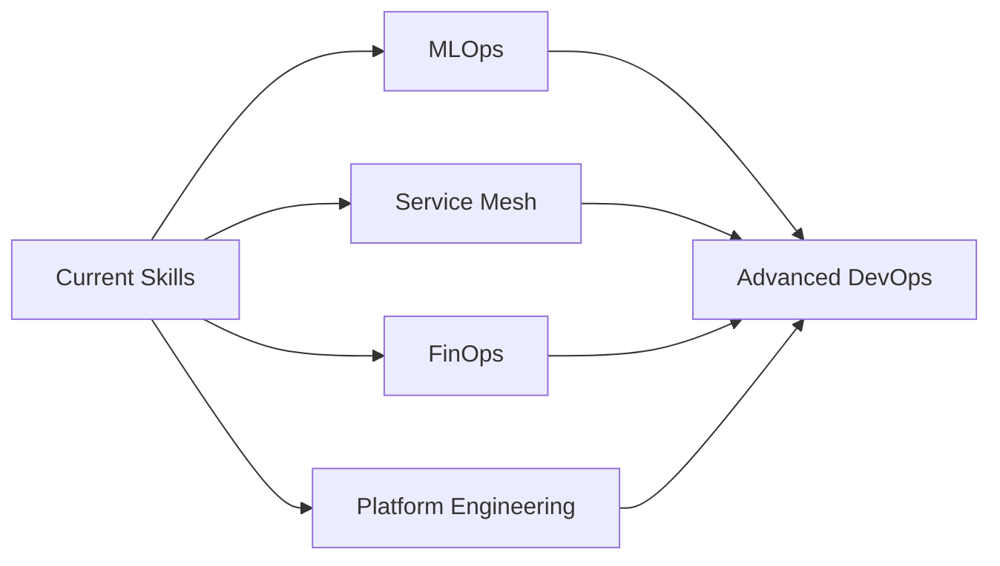

<div align="center">
  
  <!-- Profile Photo -->
  
  
  <h1>👋 Hi, I'm Bhaskar Sharma!</h1>
  
  <!-- Animated Typing Text -->
  
  
  <!-- Social Badges -->
  <p>
    <a href="https://www.linkedin.com/in/bhaskar-sharma-718122202/"></a>
    <a href="https://github.com/dankbhardwaj"></a>
    <a href="mailto:bhaskarsharma200322@gmail.com"></a>
    <a href="https://gprm.itsvg.in/"></a>
  </p>
  
  <!-- Profile Views Counter -->
  
  
</div>

---

## 🚀 About Me

```yaml
name: Bhaskar Sharma
role: DevOps Engineer | Kubernetes & Multi-Cloud Specialist
location: 📍 Noida, India
education:
  - MCA (AKTU) - Ongoing
  - BCA (CCSU) - 2023

current_focus:
  - MLOps & LLMOps Infrastructure
  - Platform Engineering
  - Multi-Cloud Architecture (AWS, Azure, GCP)
  - FinOps & Cost Optimization

expertise:
  clouds: [AWS, Azure, GCP]
  orchestration: [Kubernetes, Docker, Helm, Kustomize]
  cicd: [Jenkins, GitHub Actions, FluxCD, Argo CD]
  iac: [Terraform, Ansible, CloudFormation]
  monitoring: [Prometheus, Grafana, OpenTelemetry, Tempo]
  languages: [Python, Bash, YAML, Groovy, PowerShell]
  
key_achievements:
  deployment_time_reduction: "⚡ 40%"
  uptime_maintained: "🎯 99.9%"
  cost_optimization: "💰 20%"
  microservices_managed: "☸️ 25+"
  incident_response_improvement: "🚨 30%"
```

---

## 💼 What I Do

<table>
<tr>
<td width="50%">

### 🏗️ Infrastructure & Automation
- **Infrastructure as Code** with Terraform & Ansible
- **Multi-cloud architecture** across AWS, Azure, GCP
- **Kubernetes orchestration** (EKS, AKS, GKE)
- **GitOps workflows** with FluxCD & Argo CD

</td>
<td width="50%">

### 🔄 CI/CD & DevOps
- **Automated CI/CD pipelines** (Jenkins, GitHub Actions)
- **Container orchestration** with Docker & Kubernetes
- **Observability stack** (Prometheus, Grafana, Tempo)
- **MLOps & LLMOps** infrastructure

</td>
</tr>
</table>

---

## 🛠️ Tech Stack

### ☁️ Cloud Platforms


### 🐳 Containers & Orchestration


### 🔄 CI/CD & GitOps


### 🏗️ Infrastructure as Code


### 📊 Monitoring & Observability


### 💻 Programming & Scripting


### 🗄️ Databases & Tools


### 🤖 ML/AI Tools


### 🔧 DevOps & Other Tools


---

## 💼 Professional Experience

### 🚀 DevOps Engineer | E-commerce Platform
**📅 Jan 2023 - Present** | **📍 Noida, India**

<table>
<tr>
<td>

**Key Achievements:**
- ⚡ Reduced deployment time by **40%**
- 🎯 Maintained **99.9% uptime** for 25+ microservices
- 💰 Optimized cloud costs by **20%**
- 🚨 Improved incident response by **30%**
- ✅ Achieved **zero-downtime** deployments
- 📊 Implemented **100% IaC** - No manual provisioning

</td>
<td>

**Responsibilities:**
- Built CI/CD pipelines with Jenkins & GitHub Actions
- Managed Kubernetes clusters (EKS, AKS, GKE)
- Implemented GitOps with FluxCD
- Set up observability with Prometheus & Grafana
- Automated infrastructure with Terraform & Ansible
- Led multi-cloud architecture initiatives

</td>
</tr>
</table>

---

## 🎯 What I'm Currently Working On

```javascript
const currentFocus = {
  learning: [
    "Advanced Kubernetes Patterns (CRDs, Operators)",
    "Service Mesh Deep Dive (Istio, Linkerd)",
    "MLOps Frameworks (MLflow, Kubeflow)",
    "FinOps Best Practices"
  ],
  building: [
    "Internal Developer Platform",
    "Multi-cloud Cost Optimization Tool",
    "Kubernetes Operator for Custom Resources",
    "MLOps Pipeline Templates"
  ],
  certifications: [
    "AWS Solutions Architect Associate (In Progress)",
    "Certified Kubernetes Administrator (In Progress)",
    "Terraform Associate"
  ]
};
```

---

## 📊 GitHub Stats

<div align="center">
  
  
  
  
</div>

<div align="center">
  
  
  
</div>

---

## 🏆 GitHub Trophies

<div align="center">
  
  
  
</div>

---

## 📈 Contribution Graph

<div align="center">
  
  
  
</div>

---

## 🎓 Education

<table>
<tr>
<td align="center">
  
  <br/>
  <strong>Master of Computer Applications (MCA)</strong>
  <br/>
  AKTU | Ongoing
</td>
<td align="center">
  
  <br/>
  <strong>Bachelor of Computer Applications (BCA)</strong>
  <br/>
  CCSU | 2023
</td>
</tr>
</table>

---

## 🏅 Key Achievements

<div align="center">

| Achievement | Impact |
|------------|---------|
| ⚡ **Deployment Automation** | 40% faster deployments |
| 🎯 **High Availability** | 99.9% uptime maintained |
| 💰 **Cost Optimization** | 20% infrastructure savings |
| 🚨 **Incident Response** | 30% faster MTTR |
| ✅ **Zero Downtime** | GitOps & rolling updates |
| 📊 **Full Automation** | 100% Infrastructure as Code |

</div>

---

## 🚀 Featured Projects

### 🌍 AI-Native Platform with MLOps & LLMOps
Production-grade Kubernetes platform integrating AIOps, MLOps & LLMOps
- **Tech:** Kubernetes, FluxCD, Prometheus, Grafana, OpenTelemetry, FastAPI, Python
- **Highlights:** 
  - ✅ GitOps automation with FluxCD
  - ✅ 70% reduction in manual intervention
  - ✅ LLM token monitoring & cost optimization
  - ✅ 15-min deployment lead time, 5% change failure rate

### ⚙️ AWS ECS + ECR Deployment
Containerized Node.js app on AWS Fargate
- **Tech:** Docker, ECS, ECR, Fargate, CloudWatch, Node.js
- **Highlights:**
  - ✅ Serverless container hosting
  - ✅ Automated CI/CD pipeline
  - ✅ Complete monitoring & logging

### 🚀 Flask MySQL CI/CD Pipeline
Automated deployment for 2-tier web app
- **Tech:** Jenkins, Docker, Flask, MySQL, AWS EC2
- **Highlights:**
  - ✅ End-to-end CI/CD automation
  - ✅ Docker Compose orchestration
  - ✅ Zero-downtime deployments

---

## 💡 My DevOps Philosophy

<div align="center">
  
  ### *"Automate everything you can, monitor everything that matters, and always be ready to adapt."*
  
</div>

I believe that:
- 🤖 **Automation** is the foundation of reliable infrastructure
- 📊 **Observability** is essential for understanding system behavior
- 🔄 **Continuous improvement** is key to staying ahead
- 🤝 **Collaboration** between Dev and Ops creates the best solutions
- 🎯 **Simplicity** should be the goal of every design

---

## 🌟 Why DevOps?

I'm passionate about DevOps because it combines:
- 🔧 **Technical challenges** that require creative solutions
- 🚀 **Measurable impact** on business outcomes
- 🧩 **Problem-solving** across multiple domains
- 📈 **Continuous learning** with evolving technologies
- 🤝 **Team collaboration** for better results

---

## 📚 What I'm Learning

<div align="center">



</div>

---

## 📈 2026 Goals

- [ ] 🎯 Complete **AWS Solutions Architect** & **CKA** certifications
- [ ] 🚀 Build and launch an **Internal Developer Platform**
- [ ] 📝 Write **12 technical blog posts**
- [ ] 🎤 Speak at a **DevOps conference**
- [ ] 🤝 Mentor **10 aspiring DevOps engineers**
- [ ] 💻 Contribute to **5 open-source projects**
- [ ] 🏆 Achieve **99.99% uptime** for production systems

---

## 🤝 Let's Connect!

<div align="center">
  
I'm always excited to discuss:
- ☁️ Cloud architecture and multi-cloud strategies
- 🔄 CI/CD automation and GitOps
- ☸️ Kubernetes and container orchestration
- 📊 Observability and monitoring
- 🤖 MLOps and AI infrastructure
  
**Open to:** Full-time opportunities, consulting, and collaborations

📧 **Email:** bhaskarsharma200322@gmail.com  
💼 **LinkedIn:** [linkedin.com/in/bhaskar-sharma-718122202](https://www.linkedin.com/in/bhaskar-sharma-718122202/)  
🌐 **Portfolio:** [gprm.itsvg.in](https://gprm.itsvg.in/)  
📍 **Location:** Noida, India

</div>

---

## ⚡ Fun Facts

- 🤖 I automate everything (yes, even my coffee brewing... if it had an API)
- 📊 I believe metrics tell better stories than words
- 🌍 I think in YAML and dream in Docker containers
- 🚀 My ideal weekend: Kubernetes cluster tuning & Terraform modules
- 💡 I measure success in uptime percentages and deployment frequencies
- ☕ Coffee consumption: `while(true) { coffee++ }`

---

<div align="center">
  
  ### 💫 "Building reliable, scalable, and automated infrastructure, one pipeline at a time!"
  
  
  
  **⭐ Star my repositories if you find them helpful!**  
  **🔀 Fork, improve, and contribute!**  
  **📢 Share with fellow DevOps enthusiasts!**
  
  ---
  
  **Thanks for visiting! Let's build something amazing together! 🚀**
  
</div>

<!-- Proudly created with enhanced design by Bhaskar Sharma -->
